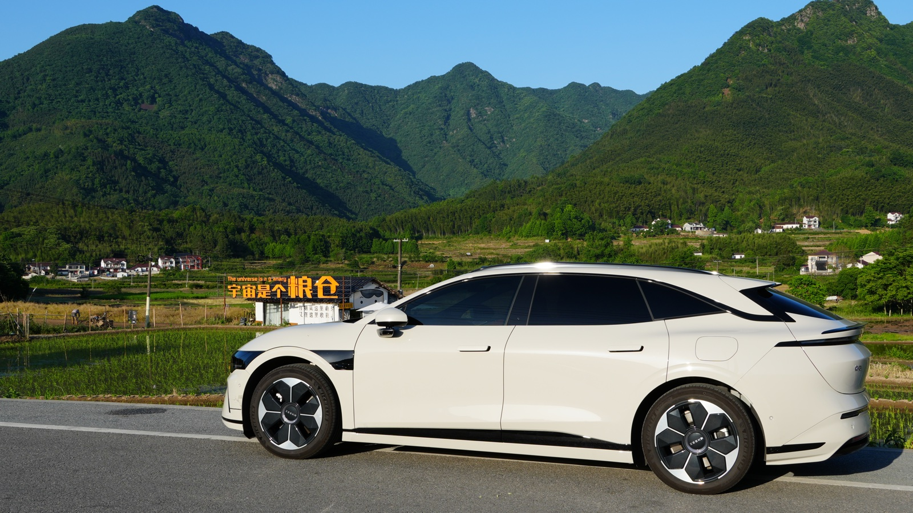

> 我的极氪 007GT（标配后驱 75 度电、晨雾米外观、红黑内饰）刚刚跑完第一个两万公里。我打算让 ta 至少陪我跑完十四万公里——这是电影《后会无期》里阿吕环游中国累积的路程。
> 

虽然短期内我并不打算换车，但趁着记忆还新鲜，我想把这两万公里里关于用车、花钱、踩坑和心动的真实感受记录下来。一方面是给自己留个档，另一方面，也是为「下一辆车」（如果还有机会买的话）提前列一份愿望清单。

如果现在就让我选下一辆车，备选大概会是这几款：[特斯拉 Model Y](https://www.tesla.cn/modely)、[小米 YU7](https://www.xiaomiev.com/yu7)、[理想 i6](https://www.lixiang.com/i6)、[极氪 7X](https://www.zeekrlife.com/zeekr7x)。下面就从我最在意的几个维度聊起。

---

## 续航与充电：75 度电勉强够用

我的车是 75 度电版本，充满后平均能跑 400 公里左右（具体取决于温度、车速、是否开空调、是否爬坡），平均能耗约 15-16 度电/百公里。

这个续航基本就是我「一天开车 + 旅行」的极限：只要不是整天赶路，一天充一次电就够，算是一个很「甜点」的范围。

对长途自驾（比如新疆）来说，更长的续航确实体验更好。但如果财力还没雄厚到可以忽略电池的成本，我宁愿把升级的钱省下来去充电——当时从 75 度升级到 100 度,要多花两万块。

至于充电速度，我的车是 800V 架构（实际六百多伏），不被抢功率的情况下充电功率在 150–280kW 之间，补能基本不超过半小时。

我在家里的车位装了充电桩，所以在家就是慢充、出门旅行才快充。家充只要别把电用到 20% 以下，一晚上就能充满。

考虑到越往后的电车续航只会更长、充电只会更快，这个维度大概率不会再困扰我。

## 四驱 / 后驱与轮胎：标配后驱真的够用，但轮胎得换

除了省钱，去年的我其实根本感受不出后驱和四驱的差别。大家都会劝你「为了安全上四驱」，但我最后还是选了标配后驱。日常开下来差别确实不大，只要在特殊场景下多留心就行。

标配轮胎确实偏滑，雨天经过高架接缝一定要慢一点才安心。等这套胎开到该换的时候，我会换一套更注重操控的，而不是只看电耗。

现在电车轮胎是真的贵。我第一次开出去就扎了钉子，而且扎在侧边、补胎也未必靠谱，换胎花了 1200+，太心疼了。

- [换马牌 MC7，胎噪、续航变化很大！？极氪 007GT 车主换胎实测_哔哩哔哩](https://www.bilibili.com/video/BV1MZJSzxE9h)
- [极氪 007GT vs 理想 i6：谁更安静？PSEV 静音棉有用吗？换胎要注意什么_哔哩哔哩](https://www.bilibili.com/video/BV1VwSqBnEaz)

下一辆车我大概会把四驱当成基础配置，哪怕只是为了一次新体验。

## 底盘：低趴的电车，旅行时最操心的地方

电车底盘往往偏低，时刻担心剐蹭是件很费精力的事，这很可能会促使我下一辆电车选 SUV 来弥补。

电车底盘一旦严重剐蹭会波及电池，而电池在整车价值里占比极高——严重起来就是全损级别。加钱上空气悬挂也不能真正解决问题，因为空悬不可能一直保持最高状态，你仍然需要有意识地切换高度。

如果完全不想操心底盘，就只能限制旅行范围、不去非铺装路面。但根据我的经验，即便是川西已经开发的主要区域，也会夹杂一些烂路，真走到那儿，往往只能硬着头皮慢慢挪。

目前我的底盘有剐蹭，但还没影响到电池。下一辆车如果有可选的空气悬挂，我一定会选。

## 保养、保险与维修：比油车省心

极氪 007GT 在芜湖第一年的保险是 **6971.95 元**。我没有逐项 battle，其实有些不必要的项目是可以回避的，这里算吃了点亏。

保养方面，小保养 400 左右、大保养 1000+，平均算下来十次保养大约一万块。一些省钱小技巧：

- **服务日**（每月第一个周二、周三）去保养，工时费一般打 7 折，能省一百多。
- **店内续保**通常能要到小保养抵扣券和油漆券。

一次保养大约一个半小时，主要是检查基础状况、告诉你电池损耗。和油车比，确实省钱又省心。

这两万公里里，我的车累计经历过这些小事故：

1. 在池州自驾时，停进一个无人维护的停车场，结果压到钉子。师傅说扎的位置在侧边、最好换掉，于是后来自己又买胎换了，补胎 50 元 + 新轮胎 1259.01 元。
2. 在县城一处狭窄的地方停车，自己蹭到电瓶车，把右前保险杠剐了。这是第一次让车出现实质损伤，难受了一整天，到处搜补救办法，最后说服自己「这只是外观问题，不处理也不影响」。
3. 在成都晚上去充电，右转忘记打灯，后面的摩托车直接冲上来剐蹭，右前保险杠的伤又加重了。
4. 26 年春节后，不知在哪剐到了右前轮毂……完全不记得是什么时候碰的。
5. 在村里，一辆不看路的电瓶车直接朝我冲过来，蹭了左前保险杠，比前两次加起来还严重。最后私了赔了 600 元，但极氪修一个面要 800 元，希望续保时能送张油漆券一起修了。

另外，洗完车之后总会在某个时刻冒出随机掉漆，这个很看路况和运气。

---

## 软件体验：最让我失望的部分

极氪的车机系统做得很差，而且越更新越差，我实在无法理解。

- 极氪有个可以装第三方 APP 的功能叫「极拓」，但 6.7 版本更新之后它无法后台运行、无法小窗运行，基本失去了存在意义。
- 无线充电位置的 NFC 检测会导致手机每次放上去都弹钱包卡片。这个行为本来可以在设置里关闭，但该选项在 6.7 之后失效了。
- 极氪自作主张改了主驾「便利进出」的逻辑，导致现在座椅不会在停车 / 启动时自动调整位置。
- 系统更新周期非常慢，基本只服务新车，上一代车往往要等一年以上才能拿到对应更新。**这很可能成为我不会再买极氪的理由。**
- 配套手机 APP 十分臃肿，功能却很弱。
- 几乎不支持任何手机互联（CarPlay、安卓流转都没有）。

相比之下，理想现在官方商店甚至支持我的绿联 NAS，差距很明显。

## 我很喜欢、希望下一辆车也保留的部分

我的车有不少地方我非常喜欢，希望下一辆车也能延续。有些功能可能很入门，但我还是记录下来，免得日后忘了它们的重要性。

- **优秀的驾驶质感**。一辆车首先要好开，我之前不选 SUV，很大原因就是它们往往不好开、坐姿也差。
- **清晰的 360 全景影像 + 便捷呼出**（方向盘按键 + 自动化配置）。看似基础，但据说特斯拉至今不支持——这也提醒我别买特斯拉。
- **终生免费不限量流量**。这个权益现在极氪新车也没了，所以并非强制项；毕竟额外流量包对车机来说也不算贵。

## 我不能接受、下一辆车必须改善的缺点

如果要买下一辆车，以下这些是必须改善的硬性缺点，我也愿意为它们多掏预算。按重要程度排序：

1. **座椅电动放倒 + 接近纯平**（至少能用床垫找平）。现在每次切换乘坐 / 睡觉状态，都要手动放倒和收起后排靠背：放倒时会重重砸到坐垫上，收起又要费不小的力气。而且即便放倒也不是纯平，用找平床垫仍有几度坡度——不太影响睡觉，但作为强迫症我难以接受。特斯拉那种电动控制看起来就很香。
2. **220V 插座**。有它就能直接在车里给电脑充电；现在虽然也能充，但只有 65W，无法保证性能释放。007GT 的 220V 插座绑在 8000 块的户外套装里卖，其他东西我用不上，所以没选——请把它做成标配。
3. **摄像头清洁**。雨天淋湿或镜头脏了，只能下车擦，车内没有清洁方式。
4. **电吸门**。免得每次都要教乘客怎么轻关门。
5. **主驾位眼镜盒**。主驾扶手毫无意义，这里就该是眼镜盒。
6. **桌板**。
7. **电动遮阳帘**。我很喜欢全景天幕（要在车里看星星），但它必须配电动遮阳帘并常关，否则太晒。
8. **行车记录仪支持四向录制**。极氪到现在还不支持四向录制，离谱。我不会再买不支持四向的车。
9. **后排空调**。我的车后排只有一个小出风口，对床车睡觉时的支持很有限。

## 锦上添花 / 有替代方案的需求

- **阅读灯**。阅读灯亮度很大程度上影响床车的夜间生活，我的车太昏暗了。极氪 7X 有个不错的前置阅读灯，但我更需要后排的——当然这个可以自己买灯解决。
- **可当相机用的前置摄像头**。极氪虽有相机功能，但画质太差、完全不可用。旅途中那么多好风景，我不可能每次都停车拍照，车前其实是个很合适的取景位置。我愿意为一颗够清晰的前摄多花钱。
- **内置 ETC**。不算重要，分开还能保持独立性。极氪新款、小米、特斯拉现在都有了。

---

## 真实开销：第一个两万公里花了多少？

第一个两万公里，**总计 18,948.36 元**。明细如下：

| 项目 | 金额（元） | 备注 |
| --- | --- | --- |
| 车险 | 6971.95 | 第一年直接在店里买，没 battle，其实可以优化；漆面券当时就该买，挺划算 |
| 充电 | 3966.64 | 快充 2360.48 + 慢充 566.16 + 家充桩安装 1040；折合每公里电费 0.144 元 |
| 过路费 | 3734.1 | 含购买 ETC 的 70 元；高速跑太多，光去年安徽往返川西就近三千公里 |
| 修车 | 1309.01 | 一条轮胎…… |
| 洗车 | 902.71 | 含洗车用品，如 PA 壶、毛巾等 |
| 停车 | 873.43 | 都是在外面停的，家里有车位 |
| 车内用品 | 658.51 | 含车载床垫 352 元，帮我省了不少酒店钱 |
| 第一年保养 | 312 | 服务日七折工时优惠 |
| 车检上牌 | 120 |  |
| 罚单 | 100 | 我讨厌宣城的国道 |

去掉非周期性支出、再算上车险降价，我估计之后每两万公里大约要花 **一万五千块**，折合每公里约 **0.75 元**。

开销偏高主要是因为高速跑太多：我没有通勤需求，市区开得也不多，大部分里程都用在出门自驾上。另外这里其实掺了不少和朋友一起出行的共同开销——往往我出路费，他们就请我吃饭。

## 一些不错的车评

- [小米 YU7 青春版？！极氪 007GT 车主 2500 公里真实分享_哔哩哔哩](https://www.bilibili.com/video/BV11zgpznEYf)
- [开了 5 天 800 公里！007GT 低配高配怎么选？_哔哩哔哩](https://www.bilibili.com/video/BV1VY7bzNE2U)
- [提车 50 天，对特斯拉焕新 Model Y 的深度总结_哔哩哔哩](https://www.bilibili.com/video/BV1yMLqziEki/)
- [特斯拉焕新 Model Y 提车一周年用车体验_哔哩哔哩](https://www.bilibili.com/video/BV1sjQPBUE66)

---

两万公里说长不长，说短不短。它足够让我从「新车的兴奋」沉淀到「真实的相处」，也让我越来越清楚：我要的不只是一辆好开的车，而是一辆能陪我把路走远、把日子过舒服的车。

剩下的十二万公里，我们慢慢跑。
