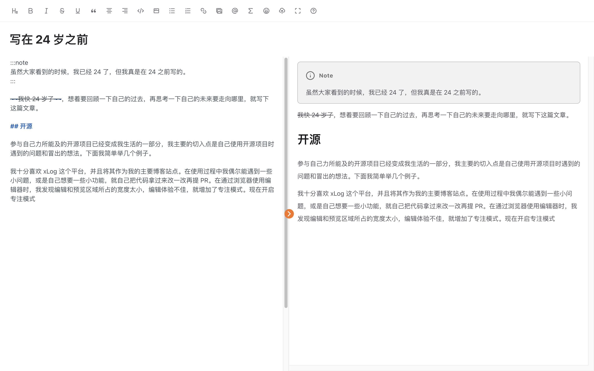

> [!NOTE]
> 虽然大家看到的时候，我已经 24 了，但我真是在 24 之前写的。

~~我快 24 岁了~~，想着要回顾一下自己的过去，再思考一下自己的未来要走向哪里，就写下这篇文章。

## 开源

参与自己力所能及的开源项目已经变成我生活的一部分，我主要的切入点是自己使用开源项目时遇到的问题和冒出的想法。下面我简单举几个例子。

我十分喜欢 xLog 这个平台，并将其作为我的主要博客站点。在使用过程中我偶尔会遇到一些小问题，或是自己想要一些小功能，就把代码拿过来改一改提 PR。
比如在通过浏览器使用在线编辑器来写博客时，我发现编辑和预览区域所占的宽度太小，编辑体验不佳，就增加了专注模式。现在开启专注模式，就可以使得页面全屏，同时隐藏与编辑区无关的元素。



又比如 `Callout` 在很多站点生成器（如 VitePress）都是内置的语法，因此我就找了个 remark 插件支持了一下，现在你可以使用如下的写法来渲染一个 `Callout`。

```
:::note
同样可以写 **markdown**
:::
```

> [!NOTE]
> 现在还支持 [GitHub Alert](https://github.com/Crossbell-Box/xLog/pull/1095)

```
> [!NOTE]
> Something
```

https://github.com/egoist/tailwindcss-icons

`tailwindcss-icons` 是一个 [UnoCSS Icons preset](https://unocss.dev/presets/icons) 在 Tailwind 这边类似的工具，我几乎每个项目都会使用它。使用的过程中遇到 TS 类型没有被正确找到的问题，但是提了 PR 后发现 issue 和 PR 好像有几个月没有被作者看了。

起初，我选择 fork 一份自己发个包。但是我马上觉得，这个小修复应当是会有益于其他使用这个项目的人的。所以，我选择在 Twitter 上联系作者，询问能不能拉我进仓库，使我能够帮忙处理一些小问题。很幸运，作者马上同意了。于是我开始给它增加一些自定义选项，修复一些 bug，觉得成就感满满。

类似的例子还有不少，比如做一个 [rsuite 的 good first issue](https://github.com/rsuite/rsuite/pull/3336)，给 star-history 增加 [深色模式](https://github.com/star-history/star-history/pull/316)，使得 sonner 能够 [同时在多个位置弹出 Toast](https://github.com/emilkowalski/sonner/pull/134)。我觉得参与开源有一万个好处，不信我数给你听：

1. 因为都是在自己喜欢的领域来解决自己的问题或是帮助他人，和完成工作上的需求完全不同，所以写起来动力满满。
2. 以一个小的需求或者 bug 入手，有助于你快速切入一个相对较大的项目，为以后做出更重要的贡献打下了基础。
3. 因为你开始尝试解决此前没处理过的问题，你能得到很快速的成长，作者的 review 也能让你学习到更多平时不熟悉的知识。
4. 你会和更多志趣相投的小伙伴链接起来，一同交流成长。
5. 开源经历作为你解决问题的能力的证明，也有助于你面试找工作，或是得到别人的认可。
6. 等等等等......

## 秋招

https://hyoban.xlog.app/work-one-year

在远程兼职一年后一文中，我介绍了我远程兼职一年来的体验，这里就不再提了。写完后的九月份也就刚好到了秋招的时候，本着「不面白不面，面了还能看看自己水平」的想法，我就开始投简历了。大概投了十几个互联网公司后，逐渐能收到笔试面试了。我最终面了快手，百度，美团三个，时间线大概是这样的：

1. 美团笔试，前端考的算法题少且简单，两个算法题都做出来了。
2. 快手一面（没有笔试）下午面完，晚上网页就上就挂了。
3. 百度一面，和面试官聊的特别好，我觉得没有理由不让我过（也确实进二面了）。
4. 美团一面，美团的面试氛围很好，内容包含基础题和项目经验，给面试结果的响应也很快。
5. 百度二面，二面问了些我不擅长的地方，答得也不好，最后挂了。
6. 然后就只有美团的面试了，一面到三面，然后 hr 面，一直到收到意向邮件。

收到美团的意向之后，我就没有再面别的公司了，收割多个 offer 不是我的目标，并且看面经、准备一轮轮面试也很消耗精力。至于美团的整个面试流程，最重要的是考察对于基础知识的掌握程度和实习项目经验，倒没有手撕算法的环节也算是幸运了。在我的 [这篇推](https://twitter.com/0xhyoban/status/1708985656687600111) 里，我也表示，如果不断拷打我算法和八股的话，我估计什么 offer 也拿不到。

回过头一看，秋招的经历和我参与工作的经历也很类似。我没有刻意准备秋招（刷力扣、背八股），只是做些我喜欢做的事情（工作、参与开源）。面试过程中，关于我远程工作和开源项目的部分被询问了很多。我想，如果没有这些，我显然是过不了面试的，毕竟我的学历和校园经历很平庸。这使得我更加坚信，我应该做更多我喜欢的事情，而不是变得世俗，变得功利。过往的每一点经历在未来总会发挥它的作用的。

## 经济

拥有一份待遇还不错的远程工作对于一个穷学生来说，真的是如雪中送碳一般。我不仅终于经济独立，还能够给予家里一些帮助。今年更新了我的主要数码设备（上半年换了 MacBook 14 寸 M1 Pro，下半年买了 iPhone 15 标准版），也给我妈换了小米 13 ultra，在我爸需要钱周转的时候马上打钱支持一下。我不再需要为了节省生活费考虑每天吃饭的开销，也不需要考虑学校里麻烦且酬劳低的兼职，能够更专心的投入自己喜欢的事情。

大学的时候，我特别喜欢折腾数码产品，经常上闲鱼上淘一些感兴趣的东西。但是，因为家里提供的生活费就那么多，大多也就是折腾玩一下就又二手出掉了。现在在经济上没什么压力，但是却不太能找到折腾的那股劲，甚至游戏也不玩了。

## 学业

对我来说，我处理的最糟糕的部分就是我的学业了，我到现在还没有搞定自己的小论文。

我清楚认识到自己没有科研的天分，也对做研究提不起兴趣，可是知道的有点晚。大学期间，我还没有找到自己在编程领域最喜欢的部分，觉得自己还找不到一份不错的工作，也都还没认识现在的小伙伴们，所以我选择延长自己的学习生涯作为缓冲。但是现在的我只想快一点结束我的学生生涯。

## 感情

我曾经喜欢过几位女生，但是还没有喜欢我的女生出现。我的家里都在催着我赶紧找对象，我的亲戚也在我我每次回家的时候给我介绍相亲对象。我对此并不反感，把相亲看作结识新朋友的方式，与参加其它活动的形式并无区别。但是我的相亲对象往往不这么想，因此几天一过一般都变成聊天列表里不会再打开的联系方式了。

我认同[《幸福的勇气》](https://book.douban.com/subject/27039296/)一书中提到的「爱并非被动坠入」一言，无条件的信赖别人，并期待着「无条件信赖我，能一起建立不可分割的“我们的幸福”」的人出现。

## 社交

最近，我尝试在 Twitter 上变得活跃一些，去与更多小伙伴建立链接。通过工作的小伙伴，我在 [Echo.js](https://podcasts.apple.com/be/podcast/echo-js/id1516139979) 蹭上了嘉宾的位子，期待即将能在技术播客月参与一档播客节目的录制。但我好像还是个不善于社交的人，常觉得对着电脑写代码更加自在。

## 未来

我还可以，还应该做些什么样的事情呢？我不喜欢孤独，希望自己不要那么宅，走出去不同的地方，见不同的人，做不同的事情。

这应该就可以概括我未来的目标了，可能是培养起读书的习惯；可能是玩几款自己喜欢的游戏；可能是去锻炼身体，去运动；可能是去旅游；可能是去面基网上的小伙伴，一起吃个饭畅谈技术，畅谈人生；等等等等。

:::assert
如果你有什么想和 24 岁的我交流的话，欢迎通过页脚的链接与我联系。
:::
