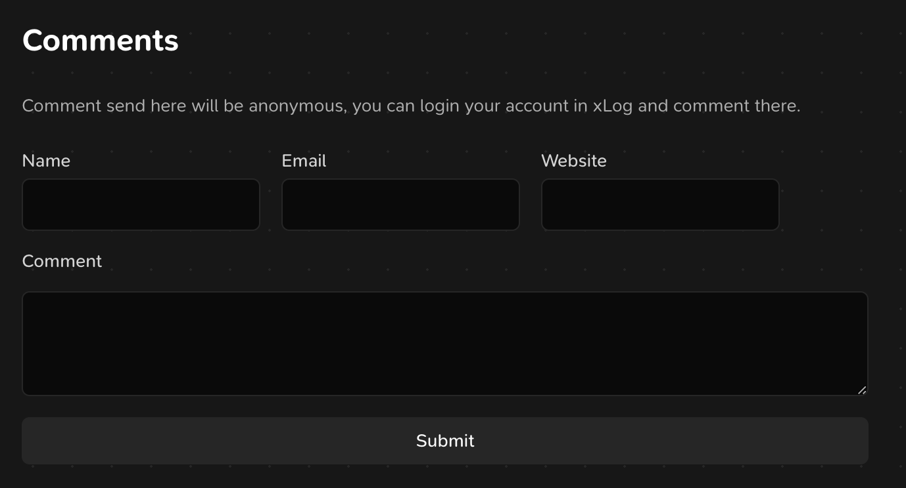

## 为什么我们需要 xLog SDK？

尽管我对于 xLog 的整体体验十分满意，但不得不说，相比于 Hexo、VitePress 之类静态生成的站点，它的访问速度还是有些慢。目前来说，我们没有简单的方式来自己部署 xLog 或是利用 xLog 的数据生成静态站点。

xLog 允许我们方便地通过 CSS 自定义网站的外观，但是当涉及到如何渲染页面时，这样的自定义程度就显得有限了。在 [如何优雅编译一个 Markdown 文档](https://diygod.cc/unified-markdown) 一文中 diygod 介绍了 xLog 如何渲染 Markdown。但是你可能会不满意代码高亮的样式，或是有支持高亮特定行的需求。有的时候，你可以通过给 xLog 提 PR 的方式来满足你的需求，但不是所有的需求都适合 xLog 的每个用户。如果我们能自己控制如何渲染 markdown 的话，就有了更多的自由度。

对于很多人来说，xLog 不是他们唯一的博客、笔记或发布日常的平台，可能有人习惯使用 VS Code 来编辑博客，有人喜欢 Obsidian。拥有一个 xLog SDK 的话，集成其它平台时，社区的作者就不需要每个人都去实现一遍 xLog server 的逻辑了。这些重复性的工作应当通过 SDK 来统一解决。

## 现在 SDK 具备的功能

https://github.com/hyoban/sakuin

我发布了 sakuin 0.1.0 版本，你可以通过 npm 安装：

```bash
ni sakuin
```

从 sakuin 导入 `Client` 并使用，它基于 `crossbell.js`。一般来说，你需要传递 `handle` 来获取特定站点的数据，它是你的 xLog 子域名。

```javascript
import { Client } from "sakuin"

const client = new Client()
const site = = await client.site.getInfo(HANDLE)
```

你可以进行如下几类操作：

1. 获取站点信息 `client.site.getInfo`
   1. 获取站点统计信息 `client.site.getStat`
1. 获取博客信息
   1. 获取全部博客 `client.post.getAll`
   1. 分页获取博客 `client.post.getMany`
   1. 获取单个博客 `client.post.get` 或是 `client.post.getBySlug`
   1. 创建博客 `client.post.put`
   1. 更新博客 `client.post.update`
1. 获取评论信息、发送匿名评论
1. 获取 short，portfolio 信息

在这里我无法介绍全部你可用的 API 和参数，你可以通过 TS 的类型来了解如何使用，后面我也会生成文档。

## 我们用 SDK 能做什么？

sakuin 是从我的博客项目衍生出来的，所以很自然的我使用它来构建[自己的博客](https://hyoban.cc)，你可以对比它和原版 xLog 的访问速度。此外，我按照自己的喜好重新实现了布局和文章的渲染，我拥有了完全可控的自由度。对接 xLog 提供的匿名评论接口，我可以轻松的实现评论模块。



https://github.com/hyoban/vscode-xlog

VS Code xLog 插件，通过这个插件，你可以下载全部的博客文章到本地，在本地编辑或创建你的博客。你同样也可以在 VS Code 中上传本地文件或是远端链接文件到 IPFS。

## 一些展望

关于 xLog SDK 的后续，我大概能想到如下几点：

1. 进一步完善第三方与 xLog 进行交互所需要的 API，与 xLog 社区作者联系，为社区作者提供统一方便的开发体验。
1. 完整实现 xLog server 的能力，将项目转到 Crossbell 组织下，甚至替换 xLog server 的目前实现。
1. 为 SDK 提供 server API，使得我们可以不用通过 SDK 来进行交互。

关于利用 SDK 集成 xLog 的想法有：

1. 集成 git commit hook，实现自动创建更新博客。

相信 xLog SDK 的出现能够让 xLog 更符合去中心化这个设定，有越来越多的人能真正的利用他们自己的数据，而不是只通过平台访问。BTW，这篇博客就是我在 VS Code 中进行编写，使用 xLog 插件发布的。
